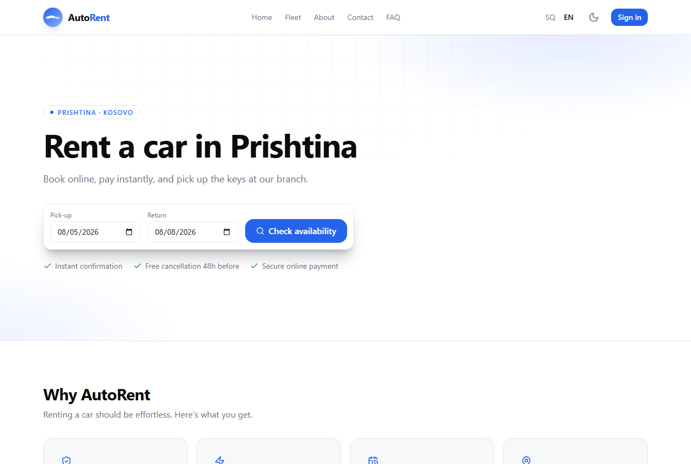
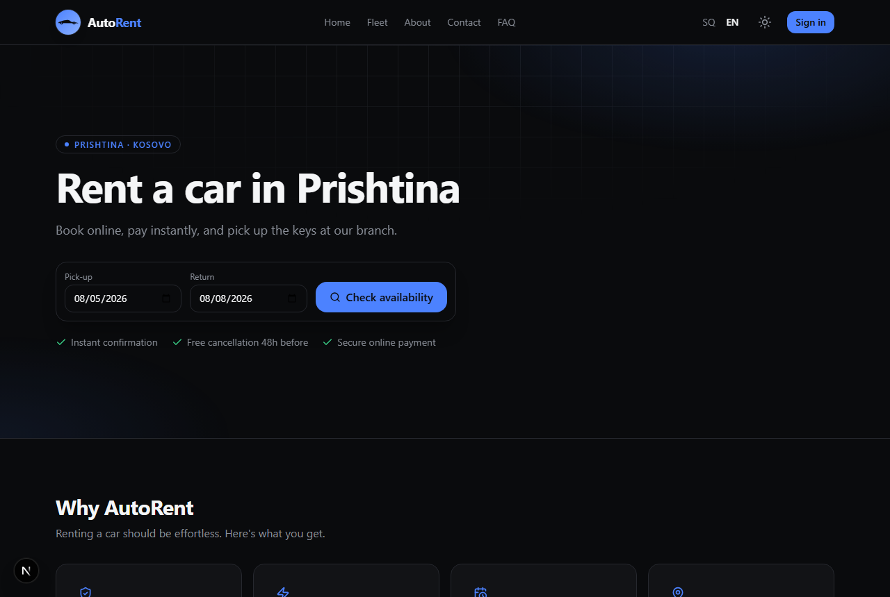
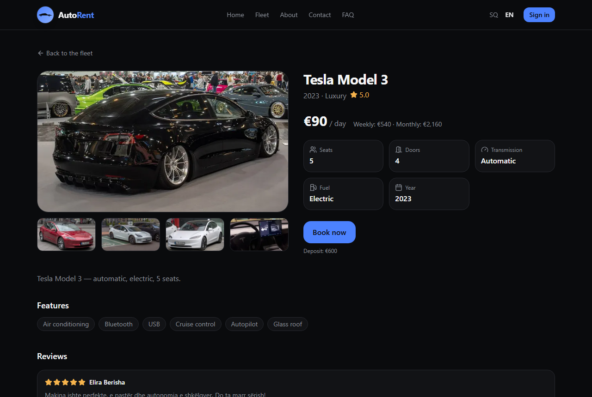
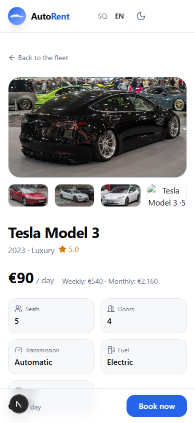

# AutoRent

A production-grade, bilingual (Albanian / English) **car-rental platform** for a single-location rental business in Prishtina, Kosovo. Customers browse the fleet, check live availability, and book and pay online in minutes; staff manage everything from a gated admin.

**▶ Live demo: [autorent-ks.vercel.app](https://autorent-ks.vercel.app)**

## Screenshots

| Home (light) | Home (dark) |
|---|---|
|  |  |

| Vehicle detail | Mobile |
|---|---|
|  |  |

---

## Highlights

- **Real booking engine** — availability is *derived* (never a stored flag), pricing is computed server-side in integer euro cents, checkout places a 15-minute hold, and a booking is only confirmed by the **Stripe webhook** (never the client).
- **Bilingual** — Albanian (default) + English, with locale-routed URLs (`/sq`, `/en`) via `next-intl`.
- **Full admin** — dashboard, bookings lifecycle (confirm / start / complete / cancel-with-refund + tier-aware extend + manual bookings), vehicle CRUD with per-car maintenance blocks, review moderation, and promo codes — gated behind an admin role.
- **Accounts & notifications** — email/password + Google auth, a bookings dashboard with policy-based cancellation, and an in-app notification system with a swappable notifier (email/SMS can drop in later).
- **Polished UX** — responsive dark UI from a shared design-token package, real model-matched vehicle photos with a lightbox gallery, an availability calendar, SEO metadata + JSON-LD, dynamic OG image, sitemap & robots.

## Tech stack

| Area | Tech |
|---|---|
| Framework | **Next.js 15** (App Router, RSC, Server Actions) · React 19 · TypeScript (strict) |
| Styling | Tailwind CSS v3 + shared `@autorent/tokens` design tokens |
| Data | **Prisma 6** · PostgreSQL (Neon) |
| Auth | **Better Auth** (email/password + Google, roles) |
| Payments | **Stripe** (Payment Intents + Payment Element + webhooks) |
| i18n | **next-intl** (SQ default + EN) |
| Validation | **Zod** (shared `@autorent/schemas`) |
| Monorepo | **Turborepo** + pnpm workspaces |
| Tests | Vitest (pricing / availability / state-machine / refund) |
| Deploy | Vercel (web) + Neon (database) |

## How the booking engine works

1. **Availability is derived**, not stored. `lib/availability.ts` computes blocking ranges from confirmed/active bookings, live 15-minute checkout holds, and maintenance blocks, using half-open intervals so a 10:00 return and a 10:00 pickup don't collide.
2. **Pricing is server-side and deterministic** (`lib/pricing.ts`). Money is integer euro cents; tiers (daily/weekly/monthly) auto-apply by rental length, then extras and a validated promo.
3. **Checkout** creates a `pending_payment` booking with a 15-minute hold and a Stripe Payment Intent; the hold is released if payment init fails.
4. **Confirmation is webhook-only.** `payment_intent.succeeded` → the booking transitions `pending_payment → confirmed` (idempotently) and fires a notification. The lifecycle is enforced by a state machine (`lib/booking-state.ts`).
5. **Cancellation** applies the policy (full refund ≥48h before pickup, 50% after, no-shows non-refundable) and issues the Stripe refund.

## Monorepo layout

```
apps/web            Next.js app (public site + /admin + /api/v1)
packages/tokens     Design tokens (colors, spacing, radii) — one source of truth
packages/schemas    Shared Zod schemas & enums
packages/i18n       Message catalogs (sq / en) + locale helpers
```

## Local setup

```bash
pnpm install

# apps/web/.env
# DATABASE_URL=postgresql://...            (Neon or local Postgres)
# BETTER_AUTH_SECRET=...                   (openssl rand -base64 32)
# BETTER_AUTH_URL=http://localhost:3000
# NEXT_PUBLIC_APP_URL=http://localhost:3000
# STRIPE_SECRET_KEY=sk_test_...
# STRIPE_WEBHOOK_SECRET=whsec_...
# NEXT_PUBLIC_STRIPE_PUBLISHABLE_KEY=pk_test_...

pnpm --filter @autorent/web exec prisma migrate deploy   # apply schema
pnpm --filter @autorent/web exec prisma db seed          # 12 vehicles, extras, promos, reviews
pnpm --filter @autorent/web dev                          # http://localhost:3000
pnpm --filter @autorent/web test                         # unit tests
```

> **Demo mode:** payments run against Stripe test mode — use card `4242 4242 4242 4242`, any future expiry, any CVC.

## Notes

Vehicle photography is sourced from Wikimedia Commons for the demo. This is a portfolio project for a fictional business; contact details are illustrative.
